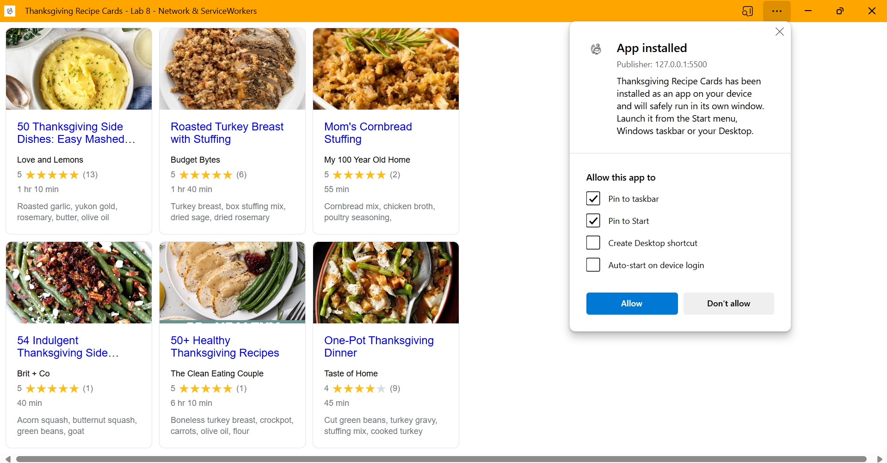

# Lab8-Starter
# Lab 8 - PWA: Network & Service Workers

## Lab Partner(s)
Kevin Peoples

## Deployed Site
[https://kepeoples.github.io/cse110-sp25-Lab8_Starter/](https://kepeoples.github.io/cse110-sp25-Lab8_Starter/)

## Graceful Degradation & Service Workers

Service workers and graceful degradation go hand in hand because service workers keep the system's core functions running when parts of it break, like the network.  Service workers do this by caching files and blocking network requests. Graceful degradation is the process of making apps work even when things aren't perfect.  This makes sure that the app can still be used when there isn't a connection or when the link is slow. This is exactly what the goal of graceful degradation is: to give users a reliable experience even when new features aren't fully available.

## Screenshot of Installed PWA

